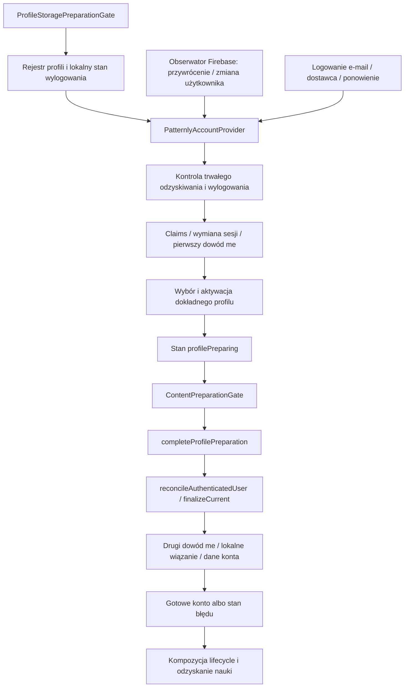

# Audyt logowania i profili — 08.10.2026

## Wynik i zakres

**Strukturalny problem jest potwierdzony. Przyczyna bieżącej awarii nie jest jeszcze ustalona.** System ma sprawdzone mechanizmy ochrony danych, ale właściciel całego przejścia od uwierzytelnienia do gotowego profilu jest rozproszony między efekty React, obserwatora Firebase, polecenia użytkownika i bramkę uruchamiania treści. Samo dzielenie dużych plików nie rozwiąże tego problemu.

Cel PO: stabilne logowanie i przywracanie sesji po aktualizacji oraz głębsza analiza nadmiernej złożoności. Zakres: SDK/persistence Firebase, sesje aplikacji, Gość/konta, izolacja danych, bariery tożsamości, odzyskiwanie, wylogowanie i uruchamianie profilu. Backend przeanalizowano na granicy `/session/exchange` i `/me`; nie jest to pełny audyt bezpieczeństwa backendu. Bez zmian logiki, schematów i danych użytkownika w ramach tego audytu.

Odbiór audytu: mapa rzeczywistych przepływów, konkretne źródła ryzyka, rozróżnienie wymaganych zabezpieczeń od przypadkowego sprzężenia, proporcjonalne testy, plan małych pakietów i jawne luki dowodowe. Odbiór naprawy jest osobny: poprawne logowanie i cold start na tym samym telefonie po aktualizacji, przy zachowaniu danych.

Źródło analizowane: APP `cd2f8599`; bieżący HEAD podczas końcowego odczytu `b13bde1f`. Różnica tych commitów w analizowanych modułach kont/profili jest pusta. Telefon ma pakiet `com.lkurczab.patternly`, versionCode 1, versionName 0.1.0. Dostępny APK z poprawką adaptera SecureStore: EAS `18b2dc7c`, źródło `f889ab4a`. Obecna instalacja otrzymywała także aktualizacje sandbox; sam numer wersji nie potwierdza konkretnego uruchomionego OTA. Nie wykonano tu kolejnej instalacji, resetu ani wylogowania.

## Mapa rzeczywistego przepływu

Ważne rozróżnienia: tożsamość Firebase, generacja sesji aplikacji, identyfikator konta Patternly, lokalny profil i dzierżawa aktywnego magazynu nie są tym samym. Nie należy sprowadzać ich do jednego `isLoggedIn` ani wyprowadzać ID konta z UID Firebase.

## Ustalenia

| ID / priorytet | Ustalenie i dowód | Skutek / pewność | Następna czynność |
| --- | --- | --- | --- |
| L01 / P0 | Zgłoszony login e-mail nie kończy się poprawnie. Na telefonie po uruchomieniu widoczny `Please sign in again`, a kontrolowany launch dał `/me` 200 o 19:55:23 i 19:55:26 UTC. Screenshot i prywatne logi w `artifacts/android-sandbox-2026-10-08`. | **VERIFIED / PARTIAL.** API 200 nie dowodzi poprawnego otwarcia lokalnego profilu ani końcowej ważności generacji. Przyczyna nieznana; nie przypisywać jej hasłu ani utracie tokena. | Najpierw ustalić etap i właściciela odrzucenia, następnie naprawić konkretny defekt. |
| L02 / P1 | `AccountSessionProvider.tsx` ma 3876 linii i prowadzi auth bootstrap, proof barriers, recovery, logout, profile activation, sync, deletion, Premium i polecenia UI. Stan/kontekst: 305–389; koordynatory/refy: 585–640; orchestration: 667–3650. | **VERIFIED / TECH_DEBT.** Zmiana jednej ścieżki wymaga rozumienia wielu niezależnych protokołów i efektów. Wielkość pliku jest wskaźnikiem koncentracji, nie samodzielnym dowodem błędu. | Wydzielić właściciela wejścia do sesji, zachowując istniejące serwisy i ich kontrakty. |
| L03 / P1 | Obserwator auth (1598–1756) oraz `signIn` → `finalizeExplicitAuthentication` (2988–3017, 1817–1854) niezależnie dochodzą do `startAuthenticatedProfilePreparation` (1125–1338). Polecenie e-mail nie blokuje obserwatora przed SDK sign-in. Istnieje single-flight zależny od UID/generacji, ale obserwator nie korzysta z kolejki poleceń w ten sam sposób. | **VERIFIED** dwie ścieżki; **INFERRED / RISK** wyścig kończenia logowania. Nie dowiedziono, że powoduje obecną awarię. | Jeden właściciel startu dla restore i jawnego logowania; test rzeczywistych interleavingów callbacków. |
| L04 / P1 | Catch obserwatora (1757–1761) sprawdza tylko `live`/`observerDetached`, po czym publikuje globalny błąd recovery i zamyka aktywny profil. Nie sprawdza rewizji zdarzenia, którą wcześniejsza część callbacku używa w 1618–1626. | **VERIFIED** brak fence; **INFERRED / RISK** starsza odrzucona operacja może nadpisać nowszy stan. To konkretny kandydat do małej poprawki, nie dowód przyczyny obecnego ekranu. | Spójny fence także na publikacji błędu; test: starszy callback odrzuca się po poprawnym nowszym wejściu. |
| L05 / P1 | Lokalne błędy wiązania/denial receipt są mapowane na `backendUnavailable` (1054–1082); podobnie część błędów proof barrier i offline scope (1370–1403, 3681–3735). `accountSessionFailureState` (3766–3771) redukuje wiele kategorii do tego samego ekranu. | **VERIFIED / TECH_DEBT.** UI i logi nie wyjaśniają, czy problem dotyczy auth, sieci, profilu czy trwałego zapisu. Ponowienie hasła może nie naprawić błędu lokalnego. | Wynik z etapem i bezpieczną kategorią błędu; diagnoza bez surowych sekretów i bez zmiany decyzji bezpieczeństwa. |
| L06 / P1 | Gotowość konta jest dokańczana z bramki treści: `App.tsx:38–42`, `ContentPreparationGate.tsx:179`, `profilePreparationBarrier.ts:8–11`, provider 1405–1414. Wybór profilu robi pierwsze `/me`, finalizacja drugie (1204–1238, 1001–1029). | **VERIFIED / TECH_DEBT.** Dwie warstwy ponownie komponują przejście konta i obsługują jego wynik. Drugi dowód może być wymagany przez aktualne bezpieczeństwo; nie usuwać go na podstawie samej liczby requestów. | Jawne fazy jednego bootstrapu; zachować kolejność i oba dowody do osobno uzasadnionej decyzji. |
| L07 / P1 | Testy składania providera i bramek często czytają źródło i sprawdzają regexy (`accountIdentityComposition.test.ts:362–372`, `profileStoragePreparationGate.test.ts:9–46`, `pendingSignInPresentation.test.ts`). | **VERIFIED** metoda tych testów; **UNVERIFIED** pełne runtime ordering. Dobre testy helperów nie uruchamiają efektów React ani natywnego SDK. | Test kompozycji: observer vs explicit login, stale rejection, dwa poprawne `/me` + awaria lokalnego receipt; osobno prawdziwy upgrade APK. |
| L08 / P2 | `profileStorageRouter.ts` (1136 linii) łączy registry, wybór zakresu, identity bindings/barriers i dziennik usuwania Gościa; `mmkvClient.ts` (1144 linii) łączy lifecycle profilu z canary/diagnostyką tej operacji. Repozytorium profili jest 39-liniową fasadą eksportów. | **VERIFIED / TECH_DEBT.** Operacje specjalistyczne oraz stan bazowego storage mają wspólne duże moduły i zależności. | Wydzielić trwały protokół usuwania i diagnostykę z routera/klienta; nie mnożyć nowych publicznych fasad. |
| L09 / P2 | Rekord instalacji Gościa jest interpretowany w routerze (`storedGuestInstallation`, 266–293) oraz `guestInstallationRepository.ts:6–33`. | **VERIFIED** dwa parsery; **INFERRED / RISK** rozjazd kontraktu, nie potwierdzony bug w tym audycie. | Jeden parser tego samego trwałego rekordu, używany przez oba obecne punkty wejścia. |

P0 dotyczy faktycznie zablokowanego użycia testowej aplikacji. Pozostałe priorytety opisują ryzyko i zakres naprawy; nie tworzą automatycznie nowej bramki całego wydania iOS.

## Co działa i musi zostać zachowane

- Izolacja namespace’ów Gościa i kont oraz exact account/UID binding. Rejestr i binding mają read-back, monotoniczne rewizje oraz blokadę przy uszkodzeniu/niejednoznaczności (`profileStorageRouter.ts:144–170, 253–387, 701–779`).
- Tombstone/bariera przed dowodem tożsamości zabezpiecza przed przywróceniem dostępu z niepotwierdzonego lokalnego wiązania. To ochrona danych, nie zbędny warunek UI.
- `recoveryOperationCoordinator`, `pendingSessionRevocation`, `accountSessionExchange` i `profileStartupCoordination` już mają odrębne kontrakty i testy. Nie należy ich zastępować jednym uniwersalnym automatem.
- Lokalny logout i trwały pending revoke są różnymi skutkami. Wylogowanie offline nie może deklarować ukończonej zdalnej revokacji.
- Obsługa `legacy_owner`/`legacy_guest` i migracji szyfrowania ma bieżących konsumentów/testy zachowania danych. Plan ogólny nie wymaga zgodności wszystkich dawnych wersji, ale bieżąca prośba chroni istniejące dane na telefonie. Usunięcie ścieżek wymaga ustalenia, które rekordy nadal ich potrzebują; nie jest pretekstem do resetu telefonu.

W badanym zakresie nie znaleziono uzasadnionej listy martwych helperów auth do natychmiastowego skasowania. Rozproszone ścieżki są osiągalne. Wydzielenie musi zastępować obecnego właściciela w tym samym pakiecie, zamiast dodawać drugą implementację.

## Proponowany podział odpowiedzialności

| Właściciel | Odpowiedzialność | Granica |
| --- | --- | --- |
| `FirebaseAuthClient` | SDK, credentials, claims, trwała sesja Firebase | Bez wyboru profilu, sync i stanów ekranów |
| `AccountSessionBootstrap` — do wydzielenia | Jeden start restore/login, kolejność proof/exchange/profile, wynik fazy i bieżący fence | Komponuje obecne serwisy; nie zmienia formatów trwałych ani zasad auth |
| Istniejący właściciel profili | Registry, scoped store, activation i exact binding receipts | Bez obserwowania SDK i bez prezentacji ekranu logowania |
| Koordynatory recovery/logout | Własne trwałe intencje, dzienniki i kontrolowane replay | Bootstrap konsultuje ich stan; nie duplikuje go przez kolejne flagi |
| `PatternlyAccountProvider` | Subskrypcja wyniku i adapter poleceń do UI | Po wydzieleniu slice nie utrzymuje równoległego bootstrapu |
| Bramki storage/content | Przygotowanie storage i lifecycle/content w uzgodnionej kolejności | Nie są dodatkowym właścicielem wejścia do konta |

Propozycja jest etapowa. Pierwsze wydzielenie obejmuje tylko start sesji, nie jednocześnie deletion, recovery, Premium, sync i cały storage.

Niezależny przegląd projektu Luna High: **APPROVE WITH BOUNDARIES**. Dopasowanie 0.91, prostota 0.84, ryzyko 0.83, utrzymywalność 0.85; minimum 0.83. Decydujące ograniczenia: brak rewrite całości, brak migracji danych na starcie, zachowanie dwóch dowodów do odrębnego przeglądu, jeden zastępowany owner i testy runtime ordering. Pierwszy pakiet dodaje bezpieczną diagnostykę pełnej ścieżki po dowodzie tożsamości i fence publikacji; nie zmienia semantyki odmowy ani nie deklaruje naprawionej przyczyny. Wydzielenie bootstrapu wycofuje zastąpioną orkiestrację, a journal/canary i parser Gościa pozostają oddzielnym follow-up poza odbiorem naprawy logowania.

## Pakiety wykonawcze i odbiór

To specyfikacja zakresów do jedynej kolejki w `PATTERNLY-WORKING-PLAN.md`, nie nowa niezależna kolejka.

**A — rozpoznanie i naprawa bieżącej awarii.** Wejścia: aktualny ekran/logi urządzenia, exact installed APK/OTA, requesty serwera. Zakres: ograniczona diagnostyka etapu/fence i konkretny defekt; pierwsze kandydaty są w providerze L04/L05. Poza zakresem: reset, usuwanie tokena/vault, zmiana auth policy i refaktor całego storage. Diagnostyka może zawierać allowlist etapu/kategorii, nie hasła, e-mail, UID, tokeny lub payload recovery. AC: wskazany rzeczywisty etap odrzucenia; controlled login i cold restart działają; błąd lokalny nie jest raportowany jako potwierdzona awaria serwera; starsze operacje nie publikują stanu nowszego profilu. Weryfikacja: runtime interleaving tests oraz ten sam Redmi, bez usuwania danych. Dowód zachowania danych klasyfikuje learning/settings/account-session/lifecycle/cache/content; nie zastępować go całym-store equality. Raport: obecny raport Androida.

**B — jeden właściciel bootstrapu konta.** Wejścia: kontrakty i reproduktor z A. Pliki: `AccountSessionProvider.tsx`, nowy kontroler bootstrapu w `src/application/account`, obecne profile/session/proof helpers, tylko konieczne punkty `App.tsx`/bramek. AC: restore i explicit login korzystają z tego samego ownera; jedno current attempt dla danego zdarzenia; stale completion nie aktywuje/zamyka innego profilu; etapowe błędy; istniejące proof/recovery/logout invariants zachowane. Usunąć zastąpioną orkiestrację providera w tym samym pakiecie. Weryfikacja: helper tests + rzeczywista kompozycja obserwatora/polecenia, Konto A/B, Gość, offline, logout pending, recovery pending; upgrade tego samego APK/profile. Ryzyko: kolejność zdarzeń SDK i data access. Zmiana polityki tożsamości wymaga nowego konkretnego security review; samo przeniesienie w zatwierdzonym kontrakcie nie daje zgody na poluzowanie zabezpieczeń. Raport: aktualizacja tego audytu z wykonanym zakresem.

**C — mniejszy właściciel profili.** Po B lub jako osobny spójny slice, bez jednoczesnej zmiany bootstrapu. Pliki: `profileStorageRouter.ts`, `mmkvClient.ts`, nowy moduł istniejącego journal/canary, wspólny parser guest marker i jego konsument. AC: profile activation/lease/identity receipts mają jeden owner; journal usuwania jest odrębny; dotychczasowy rekord i schema identyczne; interrupted writes zachowują exact data; obecne consumers używają jednego parsera. Weryfikacja: profile/storage tests, przerwania na istniejących etapach dziennika i odczyt kategorii danych wszystkich chronionych profili. Ryzyko: utrata lub niewłaściwy zakres danych; nie usuwać legacy na podstawie nazwy. Raport: mały scope+evidence update.

**D — odbiór zmian przy aktualizacji.** Ten sam telefon/pakiet/podpis; bez clear-data/uninstall. Oddzielnie: persisted auth cold start, jawny e-mail login, profil A→logout→B, Gość→konto z wyborem adopcji, offline logout/pending replay i interrupted recovery. AC: exact current profile, brak dostępu do innego konta, preserved categories, właściwa akcja retry, brak fałszywego sukcesu. Odbiór na iOS osobno na istniejącym iPhone 17, gdy jego runtime jest częścią zmiany; urządzenia sekwencyjnie. Platforma/artefakt jest zapisana w wyniku, nie domniemywana z samego CI.

## Weryfikacja i ograniczenia

- Root: 125/125 PASS, 0 FAIL/SKIP, testy `accountIdentityComposition`, `profileStartupCoordination`, `profileStorageRouter`, `encryptedStorageBootstrap`, `secureAuthPersistence`, `profilePreparationBarrier`. Log: `artifacts/android-sandbox-2026-10-08/login-profile-audit-tests.log`. Ten pakiet potwierdza badane helpery i kontrakty, nie mount providera/native upgrade.
- Wcześniejszy adapter SecureStore: 38 vault/coordinator tests + typecheck + independent review + CI PASS. Faktyczny Android SDK nie eksportuje iOS-only constant, więc błąd adaptera był rzeczywisty; jego poprawka nie dowodzi usunięcia obecnego błędu logowania.
- Niezależne read-only analizy: Luna High auth/session oraz Luna High profile/storage. Bez zmian kodu i danych przez reviewerów. Wnioski skonfrontowano z kodem i z aktualnym ekranem/HTTP.
- Telefon: ADB odzyskane, aplikacja uruchomiona; captured screenshot `login-screen.png` pokazuje revokedSession. 13 linii logu jej procesu nie zawiera przyczyny błędu. Brak obserwacji kontrolowanego wpisania credentials i exact failure stage; żaden reviewer nie twierdzi pełnego native PASS.
- Wiersz planu R06 zawiera historyczny odbiór e-mail login. Obecna awaria wymaga nowego odbioru obecnego artefaktu. Historyczne PASS pozostaje historią, nie dowodem bieżącej gotowości.
- Nie ma dowodu, że każde zgłoszone potknięcie po aktualizacji ma jedną wspólną przyczynę. Obecny audyt potwierdza nadmierne sprzężenie i konkretne luki, nie pełny katalog runtime defects.

Pierwszy następny pakiet: A. Jego wynik dostarcza reproduktor i granicę odpowiedzialności potrzebną do B. Nie zaczynać od zmiany formatu persistence ani masowego przenoszenia plików.

## Immediate repair after PO authorization

Confirmed cause: after a successful exact `/me` proof, `finalizeCurrent` called `clearAccountIdentityDenialAfterProof` before account materialization. Newly opened account namespaces contain an unbound installation and an empty sync projection, so the old helper falsely returned `false` even without any identity-denial marker. The provider displayed `revokedSession` before loading account progress.

Minimal repair: reject stale scope/proof, missing/corrupt installation and foreign nonnull account IDs first. With no denial marker, return success without any data writes; with an actual denial, preserve the exact fully-bound account checks and verified clearing. No authentication policy, profile routing, proof ordering, or journal change. Source commit main `4cf057a3`, isolated Android deployment source `d99445d3` on `f889ab4a`.

Independent review APPROVE: fit0.96, simplicity0.94, risk0.88, maintainability0.92, minimum0.88. 99 account lifecycle/composition tests PASS (including fresh-profile materialization, foreign-account and stale-proof refusal, unbound-denial preservation) and typecheck PASS. Device acceptance for the reported blocker: Android sandbox update group `267c31dd-4100-4c36-97bd-14bf05833b71`, update `01a11d23-f155-7a91-bafd-fd8bcfd67df3`, runtime0.1.0. All455 bundled local app sources matched the isolated checkout. Before update, the same phone displayed `Please sign in again`; after activation it reached Home, Settings displayed `Signed in as`, and a second cold start reached Home. No sign-out, credentials entry, vault reset, uninstall, or data reset was performed. Correlated server responses20:12UTC: `/me`200 twice then `/progress`200 and `/entitlements`200. This establishes restoration after this OTA and resolution of the observed block, not the complete fresh-login/upgrade matrix. The architectural follow-up is the canonical plan task AUTH-PROFILE-01.

Final independent acceptance review: PASS; reviewer independently repeated99/99 lifecycle/composition tests and verified isolated deploy matches the production diff. GitHub CI37837210351 SUCCESS for source4cf057a3. Standalone EAS5250177f FINISHED; phone install blocked by insufficient storage, with existing repaired OTA still active and final Home verified.
